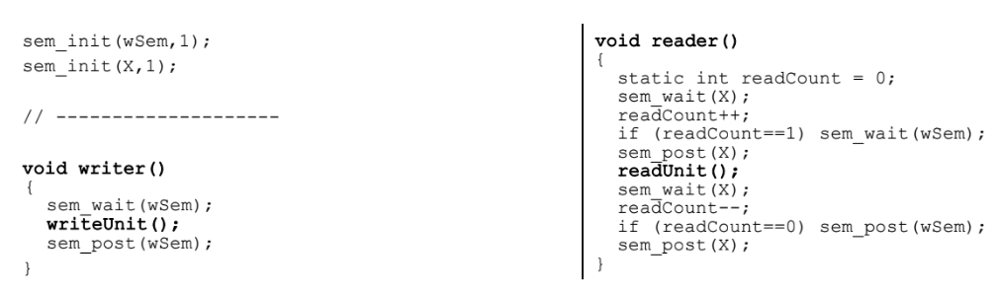

# Exame 2012-2013

## 1
- [ ] 1. [Verdade] (Escalonamento preenptivo demora menos tempo que não-preemptivo) -> Falso
- [x] 2. Verdade (?)
- [x] 3. Falso (Meso«mo ficheiro aberto por processos diferentes tem fd diferentes)
- [x] 4. Verdade (espera circular -> deadlocks)
- [x] 5. Verdade
- [x] 6. Falso (Processo filho recebe cópias de variáveis locais)
- [ ] 7. Verdade (Evitar processos Zombie) -> Falso, porocessos zombie continuarão a consumir recursos, não interferindo com os restantes processos
- [x] 8. Falso (FIFO não permite comunicação entre dois computadores diferentes)
- [x] 9. Verdade (Múltiplos sinais enviados ao mesmo tempo poderão não ser processados pelo handler)
- [ ] 10. Verdade -> Falso, recebem uma referência para t, pelo que é o mesmo valor (?)

## 2

- a) **Importância de Direct Memory Access e multiprogramação**  
  Num sistema de multiprogramação é necessário interagir com memória e DMA permite permite que o processador continue a executar outras instruções enquanto interage com memória.

- b) **Variação dinâmica prioridade de processos**
  Alguns processos de elevada prioridade poderão entrar num estado do inanição, não chegando a ser executados, pelo que é vantajoso aumentar gradualmente a prioridade dos processos com menor prioridade.

- c) **Forma de comunicação de processos**
    
    - Memória partilhada - bidirecional (necessária sincronização)
    - Pipes (sem nome) - unidirecional
    - Sinais - comunicação rápida de apenas um sinal

- d) **Influência do "hit ratio" na paginação a pedido**  
  Hit ratio reduzido -> elevado número de páginas não se encontram em memória, sendo necessário carregá-las -> influência negativamente a performance.
  
## 3

- a) / b)

```c
#include <stdlib.h>
#include <stdio.h>
#include <unistd.h>
#include <string.h>
#include <fcntl.h>

int redirectStdin(char* filename){
    int fd = open(filename, O_RDWR);
    if (fd == -1){
        perror("Openning file\n");
        return -1;
    }

    int dup_fd = dup2(STDIN_FILENO, fd);

    if (dup_fd == -1){
        perror("Redirect stdin\n");
        return -1;
    }

    return 0;
}

int main(){ //-> main(int argc, char[] *argv)
    int numValuesRead, value;

    if (redirectStdin("infile.txt") < 0){ //->redirectStdin(argv[1])
        perror("redirectStdin");
        exit(1);
    }
    numValuesRead = scanf("%d", &value);
    if (numValuesRead == 1){
        printf("'value' = %d was read from 'infile.txt'\n", value);
        exit(0);
    }
    else{
        printf("Error reading 'value' from 'infile.txt'\n");
        exit(1);
    }
}
```

## 4

- a)




- b) **Estado dos semáforos em t=10**
wSem -> W1, W2 e R3 bloqueado
X -> R3

## 6

```c
#include <stdlib.h>
#include <stdio.h>
#include <unistd.h>
#include <signal.h>
#include <sys/types.h>
#include <sys/wait.h>
#include <sys/stat.h>
#include <string.h>
#include <time.h>
#include <fcntl.h>
#include <pthread.h>
#include <semaphore.h>

#define N 100 // buffer size
char buffer[N];
int ri = 0; // read index
int wi = 0; // write index
pthread_mutex_t mut = PTHREAD_MUTEX_INITIALIZER;
sem_t canIread, canIwrite;

int open_in_fifo(char* fifoName) {
    int fd = open(fifoName, O_RDONLY | O_NONBLOCK);
    if (fd < 0)
        pthread_exit(0);
    return fd;
}
void* receive(void* p) {
    int f = open_in_fifo(p);
    char c;
    while(read(f,&c,1)){
        printf("Read from FIFO %s the value %d\n", (char*)p, c);

        //c) Permite que não hajam threads a alterar o buffer ao mesmo tempo
        pthread_mutex_lock(&mut);
        buffer[wi++] = c;
        wi %= N;
        pthread_mutex_unlock(&mut);
        //--

        if (wi == 0){
            sem_post(&canIwrite);
            sem_wait(&canIread);
        }
    }
    close(f);
}

int open_out_fifo(char* fifoName) {
    int fd = open(fifoName, O_WRONLY | O_NONBLOCK);
    if (fd < 0)
        pthread_exit(0);
    return fd;
}

void* send(void* p) {
    int f = open_out_fifo(p);
    for(;;){
        if (ri == 0){
            sem_wait(&canIwrite);
        }
        printf("Write to FIFO %s the value %d\n", (char*)p, buffer[ri]);
        write(f,&buffer[ri++],1);
        ri %= N;

        if (ri == 0){
            sem_post(&canIread);
        }
        
    }
    close(f);
}

void init_semaphores() {
    sem_init(&canIread, 0, 0);
    sem_init(&canIwrite, 0, 0);
}

void destroy_semaphores() {
    sem_destroy(&canIread);
    sem_destroy(&canIwrite);
}
int main(int argc, char** argv) {
    pthread_t st; // send thread
    pthread_t* rt; // receive threads
    if (argc < 3){
        perror("Usage ./6 f1 [f2 [..[fn]]] fout\n");
        exit(1);
    }

    init_semaphores();

    //a)
    rt = malloc(sizeof(pthread_t)*(argc-2));
    pthread_t* safe = rt;
    pthread_t* safe2 = rt;
    for (int i = 1; i < argc-1; i++)
        pthread_create(rt++, NULL, receive, (void*)argv[i]);
    pthread_create(&st, NULL, send, (void*)argv[argc-1]);

    for (int i = 0; i < argc-2; i++){
        pthread_join(*safe, NULL);
        safe++;
    }
    pthread_join(st, NULL);
    //--

    free(safe2);
    destroy_semaphores();

    return 0;
}
```

