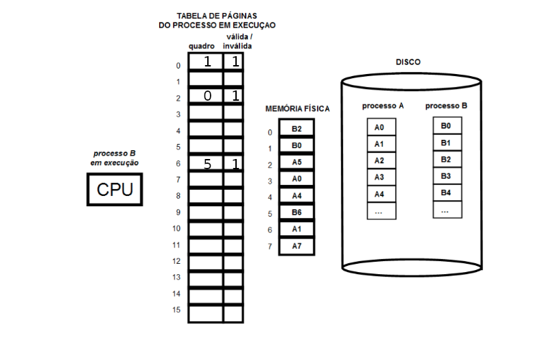

# 2014-15

## 1
 - a)

    - **I/O bursts**: perídos em que um processo não necessita do processador para executar outro processo.
    - **Multiprogramação**: técnica utilizada para tirar partido desses períodos.

 - b)

    - A informação de um processo encontra-se no **PCB (Process Count Blocks)**, que contém:

        - ID
        - Estado do processo
        - Registos
        - Informação de escalonamento do CPU (prioridade)
        - Gestão de memória 
        - Contabilidade
        - Estado I/O

 - c)
  
   - Técnicas de escalonamento podem retirar o processador a um processo, garantindo que este não gasta os seus recursos desnecessariamente.

## 2

- a)
    
    - De forma a inicializar um semáforo como se fosse um mutex, deverá-se inicializar o respetivo contador a 1, garantindo que apenas uma thread executa a secção crítica delimitada pela zona de ação do semáforo "ao mesmo tempo".

- b)

    - Em linux ao **inicializar um semáforo com um número negativo**, este será interpretado como um número inteiro muito grande. Isto acontece pois a inicialização do semáforo é feita com um **unsigned int**; ao inserir um número negativo ocorrerá overflow.

- c)

    - c1) Considerando que o dinheiro se encontra num mesmo depósito, as tranferências bancárias tratam-se de secções críticas uma vez que apenas não poderão haver dois processos a alterar essa quantia ao mesmo tempo, havendo riscos de perda ou ganho de dinheiro.

    - c2) **Exemplo de deadlock em contas bancárias**
        - Numa situação em que existem duas contas A e B, e em que A pretende fazer uma transferência para B e B pretende fazer uma transferência para A ao mesmo tempo. 

        - Neste caso poderiam ser tido em conta um semáforo para cada conta inicializado a 1 que ficásse bolqueado quando uma conta estive envolvida numa transferência.

        - Em cada transferência são assim bloqueados os semáforos da conta origem e da conta destino.

        - Caso ambas as tranferências sejam realizadas ao mesmo tempo poderá acontecer que numa fase inicial ambas as tranferências bloqueiem as contas origem A e B, ficando depois ambas à esperam que as contas destiono estejam desbloqueadas, o que nunca acontecerá pois quem está na posse desse semáforo é a transferência na ordem contrária.

## 3

- a) **Espaço de endereçamento lógico**: 16 páginas e 1 kB / página -> 16kB

- b)
    - **Páginas têm igual tamanho que os frames.**
    - Endereço lógico: log<sub>2</sub>(16*1024)
    - Endereço físico: log<sub>2</sub>(8*1024)

- c)

 (bits não assinalados = 0)

- d) Ordem de acesso das páginas: (algoritmo LRU)
        
        A0-B0-A1-A7-B2-A5-B0-A4-A0-B2-B6-A0

    - Endereço lógico: 2000<sub>10</sub>
    - A1: Least Recently Used
    - 2000 / 1024 = 1, pelo que o endereço lógico corresponderá à posição 1 (B1)
    - Este processo ocupará assim a região de A1, na "posição 6" da memória física.
    - Offset: 2000 % 1024 = 976
    - Endereço físico: 6 * 1024 + Offset = 7120


## 4

 - Cada ficheiro e diretório possuem um inode associado.
 - Cada entrada do diretório aponta para o inode respetivo.
 - Um inode contém:
    
    - tipo de ficheiro: regular, diretório...
    - permissões de acesso
    - identificador e dono do grupo
    - localização dos blocos (para ficheiros regulares e diretórios) 

## 5

- a) 
    - Dir home -> diretório quando o terminal é aberto.
    - Diretório corrente -> diretório onde o  utilizador se encontra.
    - Pode-se obter o diretório **home** do utilizador que executa o programa chamando **printenv HOME**

- b) / c) / d)

``` c
#include <stdio.h>
#include <fcntl.h>
#include <stdio.h>
#include <unistd.h>
#include <string.h>
#include <dirent.h>
#include <sys/types.h>
#include <sys/stat.h>
#include <sys/wait.h>
#include <stdlib.h>

#define READ 0
#define WRITE 1

struct info{
    int filetype; //1, 2 or 100
    int inodenr;
    int blksize;
    char name[50];
};

int main(int argc, char *argv[]){
    DIR *dirp;
    struct dirent *direntp;
    struct stat stat_buf;
    int status;
    
    int fd[2];
    pipe(fd);

    if ((dirp = opendir(argv[1])) == NULL){
        perror(argv[1]);
        exit(2);
    }

    while ((direntp = readdir(dirp)) != NULL){
        if (strcmp(direntp->d_name, ".") == 0 
        || strcmp(direntp->d_name, "..") == 0) continue;
        struct info info;

        char fp[PATH_MAX];
        snprintf(fp, sizeof(fp), "%s/%s", argv[1], direntp->d_name);
        strcpy(info.name, direntp->d_name);
        

        if (lstat(fp, &stat_buf)==-1){
            perror("lstat ERROR");
            exit(3);
        }
        
        if (S_ISREG(stat_buf.st_mode)) {
            if (strcmp(direntp->d_name, argv[2]) == 0)
                info.filetype = 100;
            else
                info.filetype = 1;
        }

        else if (S_ISDIR(stat_buf.st_mode))
            info.filetype = 2;
        
        info.inodenr = stat_buf.st_ino;
        info.blksize = stat_buf.st_blksize;
        write(fd[WRITE], &info, sizeof(info));

        int pid = fork();
        if (pid == 0){
            close(fd[WRITE]);
            dup2(fd[READ], STDIN_FILENO);
            execlp("./formatter", "./formatter", NULL);
        }
        else if (pid > 0){
            waitpid(-1, &status, WNOHANG);
        }
    }
    closedir(dirp);
}
```

- e) 
    - If the parent is killed, children become children of the init process (that has the process id 1 and is launched as the first user process by the kernel).

    - The init process checks periodically for new children, and waits for them (thus freeing resources that are allocated by their return value).

## 6

 - a) / b) / c)
```c
#include <stdlib.h>
#include <stdio.h>
#include <unistd.h>
#include <sys/types.h>
#include <string.h>
#include <time.h>
#include <fcntl.h>
#include <pthread.h>
#include <semaphore.h>
#include <pthread.h>
#include <sys/mman.h>

#define SEM_INI 0

struct Data{};

struct Data buffer[10];

sem_t sem;

void* thread1(void *arg){
    for (int k=0; k<10; k++) {
        fill(&buffer[k]);
        //c)
        sem_post(&sem):
    }
}

void* thread2(void *arg){
    for (int k=0; k<10; k++) {
        //c)
        sem_wait(&sem);
        process(&buffer[k]);
    }
}

int main(void){
    //a) Second option (shared memmory region) - need to pass as parameter
    // and cast in thread functions:
    //
    // strcut Data *buffer = mmap(NULL, 10*sizeof(struct Data), 
    //                     PROT_READ, PROT_WRITE, 
    //                     MAP_SHARED | MAP_ANONYMOUS, -1, 0);

    //b)
    sem_init(&sem, 0, SEM_INI);

    pthread_t tid[2];
    pthread_create(&tid[0], NULL, thread1, NULL);
    pthread_create(&tid[1], NULL, thread2, NULL);
    pthread_join(tid[0], NULL);
    pthread_join(tid[1], NULL);
}
```

 - d) Não seria conveniente substituir o semáforo por um mutex, pois o efeito do mutex poder-se-ia comparar a um semáforo inicializado a 1, o que permitiria que, inicialmente, a função process pudesse ser executada antes de fill.

 - e) 
    - **tf < tp**:
        
        - thread com fill(): 10*tf
        - thread com process(): tf + 9*(tf-tp) + 10*tp

    - **tf > tp**:
        
        - thread com fill(): 10*tf
        - thread com process(): tf + 10*tp