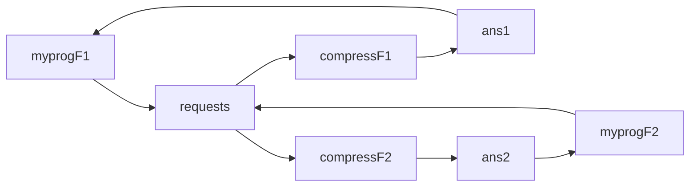

# 2017-18

## 1 Relação entre DMA e multiprogramação

- **Multiprogramação** - execução intercalada de processos. Várias tarefas são mantidas em memória simultaneamente, sendo o CPU partilhado entre elas. 
- Um dos requisitos para multiprogramação é a existência de **hardware de DMA**.
- Quando é necessário realizar instruções de I/O, o processdor informa o dispostivo controlador de I/O do que pretende fazer e onde está/vai ficar a informação a tranferir, continuando a executar outras instruções.
- O dispositivo de I/O transfere a informação diretamente de/para a memória.
- Quando o acesso direto a memória termina é gerada uma interrupção.

## 2

- a)
```c
typedef struct{} PData;

PData pdata;
sem_t produce, consume;
void put(PData *x);
PData get();

void* t1(void* arg){
    sem_wait(&produce);
    put(&pdata);
    sem_post(&consume);
}

void* t2(void* arg){
    sem_wait(&consume);
    pdata = get();
    sem_post(&produce);
}

int main(void){
    sem_init(&produce, NULL, 1);
    sem_init(&consume, NULL, 0);
}
```

- b1) **Secção crítica** - processo executa código que manipula dados/recursos partilhados, podendo contudo ser interrompida para correr outros processos desde que esses processos não tenham uma secção crítica correspondente à do processo atual.

- b2) Mecanismos de sincronização como semáforos permitem garantir que o código é executado numa secção crítica.

- c) **Prevenção de deadlocks** assegurar que pelo menos 1 das seguintes condições não se verificam: 
    
    - exclusão mútua;
    - retém e espera;
    - não preempção dos recursos;
    - espera circular.
    
## 3 

Algoritmos de **escalonamento do processador** tendem a penalizar os processo **CPU-bound**. São processos que passam a maior parte do seu tempo de execução a usar CPU, podendo ter CPU bursts muito longos.

## 4

- a) **Overlay**
    - Para **executar mais processos que ocupam mais memória do que a memória disponível** é necessário recorrer à técnica de **overlay**.
    - É uma técnica de sobreposição que permite carregar partes difrentes de um programa na mesma memória (em alturas diferentes).
    - Partes do programa, identificadas pelo programador, são compiladas e linkadas de modo a poderem correr nos endereços da secção de overlay.
    - Um overlay driver (sob controlo do programa) carrega diferentes overlays da memória secundária para a secção de overlay.
    - O carregamento é feito dinamicamente: os processos e dados são trazidos para memória quando necessário, através de código gerado pelo compilador. 

- b)    
    - Maior aproveitamento do número de páginas;
    - Menor erros de acesso a memória.

## 5

Cada ficheiro tem um **inode** associado. O inode contém informação sobre o ficheiro como:
    
- tipo de ficheiro;
- permissões de acesso;
- identificador e dono do grupo;
- localização dos blocos de informação (ficheiros regulares e diretórios) 

## 6
- **Percorrer diretório**
- **Fork()**
- **execl()**

```c
#include <stdio.h>
#include <stdlib.h>
#include <string.h>
#include <dirent.h>
#include <sys/stat.h>
#include <errno.h>
#include <string.h>
#include <linux/limits.h>    
#include <unistd.h>
#include <sys/types.h>
#include <sys/wait.h>
#include <signal.h>

char destination_dlr[50];
char filename[50];
int status;

int main(int argc, char *argv[]){
    //1)
    if (argc != 4){
        printf("Invalid number of arguments\n");
        exit(1);
    }
    //2)
    strcpy(destination_dlr, argv[3]);
    strcpy(filename, argv[2]);
    strcpy(dirpath, argv[1]);

    //3)
    struct sigaction action;
    action.sa_handler = SIG_IGN;
    sigemptyset(&action.sa_mask);
    action.sa_flags = 0;

    if (sigaction(SIGINT,&action,NULL) < 0){
        fprintf(stderr,"Unable to install SIGINT handler\n");
        exit(1);
    }

    //4)
    process_dir(argv[1]);

    return 0;
}

int process_dir(char *dirname)   {
    DIR *dir;
    struct dirent *entry;
    struct stat statbuf;

    if (!(dir = opendir(dirname))) return 1;
    while ((entry = readdir(dir)) != NULL) {
        char path[1024];
        // ‐‐‐ BLOCO A ‐‐‐
        sprintf(path, "%s/%s", dirname, direntp->d_name);

        if (lstat(path, &statbuf)==-1){
            perror("lstat ERROR");
            exit(3);
        }
            
        if (S_ISDIR(stat_buf.st_mode)) {
            if (strcmp(entry->d_name, ".") == 0 || strcmp(entry->d_name, "..") == 0)
                continue;
            // cria um processo que invoca process_dir()
            if (fork() == 0){
                process_dir(path);
                exit(0);
            }
            else wait(&status);
        }  
        // ‐‐‐ FIM DO BLOCO A ‐‐‐
        // ‐‐‐ BLOCO B ‐‐‐
        else if (S_ISREG(stat_buf.st_mode)) { // se 'entry' for um ficheiro regular
            if (strstr(entry->d_name, filename) != NULL) { // se o nome do ficheiro contiver filename
                // cria um processo que invoca o utilitário 'cp'
                if (fork() == 0){
                    execlp("cp", "cp", filename, destination_dlr, NULL);
                }
                else wait(&status);
            }
        }
        // ‐‐‐ FIM DO BLOCO B ‐‐‐
    }
    return 0;
}
```

## 7

- a) **Requests and Answer with PIPES**


```c
#include <stdio.h>
#include <stdlib.h>
#include <string.h>
#include <sys/stat.h>
#include <errno.h>
#include <linux/limits.h>    
#include <unistd.h>
#include <sys/types.h>
#include <sys/wait.h>
#include <signal.h>
#include <fcntl.h>
#define BUF_SIZE 999;
#define READ 0
#define WRITE 1

void full_copy(int from, int to) {
    char buffer[BUF_SIZE]; // BUF_SIZE < 1000
    size_t n;
    while ((n = read(from, buffer, BUF_SIZE)) > 0)
        write(to, buffer, n);
    close(from);
    close(to);
}

int main(int argc, char *argv[]){
    int fd[2];
    pipe(fd);

    pid_t pid = fork();

    if (pid < 0){
        close(fd[WRITE]);
        dup2(fd[READ], STDIN_FILENO);
        execl("./compress", "./compress", NULL);
    }
    else if (pid == 0){
        close(fd[READ]);
        int file = open(argv[1], O_RDONLY);
        full_copy(file, fd[WRITE]);
    }
    return 0;
}
```

- b) **Requests ans Answer with FIFOS**


```c
#include <stdio.h>
#include <stdlib.h>
#include <string.h>
#include <sys/stat.h>
#include <errno.h>
#include <linux/limits.h>    
#include <unistd.h>
#include <sys/types.h>
#include <sys/wait.h>
#include <signal.h>
#include <fcntl.h>
#define BUF_SIZE 999;

struct Request {
  pid_t pid;
  size_t nbytes;
  char data[1000];
};

struct Reply {
  size_t nbytes;
  char data[1000];
};

void createRequest(const char *filename,  
                   struct Request *req)  {
    int file = open(filename, O_RDONLY);
    char buffer[BUF_SIZE]; // BUF_SIZE < 1000
    size_t n;
    req->pid = getpid(); req->nbytes = 0;
    while ((n = read(file, buffer, BUF_SIZE)) > 0) {
        memcpy(&req‐>data[req->nbytes], buffer, n);
        req->nbytes += n;
    }
    close(file);
}

int main(int argc, char *argv[]){
    mkfifo("requests", 0660);
    char fifoname[50];
    sprintf(fifoname, "ans%d", getpid());
    mkfifo(fifoname, 0600);

    int req = open("requests", O_WRONLY);
    int ans = open(fifoname, O_RDONLY);

    pid_t pid = fork();

    struct Request request;
    createRequest(argv[1], &request);
    write(req, &request, sizeof(request));

    if (pid > 0){
        int status;
        wait(&status);
        struct Reply reply;
        read(ans, &reply, sizeof(reply));
        write(STDOUT_FILENO, reply.data, reply.nbytes);
    }
    else if (pid == 0){
        execl("./compressF", "./compressF", NULL);
    }

    close(req);
    close(ans):
    unlink("requests");
    unlink(fifoname);

    return 0;
}
```

- c) Escrevendo mais que 4096 bytes (**PIPE_BUF**) não é garantido que a instrução seja realizada atomicamente (iterligada com a escrita de outros processos que escrevam para o mesmo pipe). Assim deixam de haver garantias de que a escrita para o pipe/fifo de processos entrelaçados seja feita corretamente.

## 8

- a) **Criação de threads**
```c
// global:
#define NB 10
int food_bits = 0;
int main(){
    pthread_t tid_bird, tid_baby[NB];
    int num[NB];
    pthread_create(&tid_bird, NULL, bird, NULL);
    for (int i = 0; i < NB; i++) {
        num[i] = i;
        pthread_create(&tid_baby[NB], NULL, baby, (void*)&num[i]);
    }
}
```

- b)

```c
// global:
int finish = 0;
int food_bits = 0;

void *bird(void *arg) {
    while (finish == 0) {
        if (food_bits == 0) {
            get_food();
            food_bits = F;
        }
    }
    return NULL;
}

void *baby(void *arg){
    int n_bits = 0;
    int id = (int) *arg;

    while(1){
        if (food_bits == 0){
            fprintf(stderr, “I am baby %d, I have already eaten %d bits of
                                food and I am still hungry!”, id, n_bits);
        }
        else{
            food_bits--;
            n_bits++;
        }
    }
}
```

- c) **Inicialização semáforo**

```c
int finish = 0;

sem_t produce;
sem_t consume;

sem_init(&produce, NULL, 1);
sem_init(&consume, NULL, 0);

void *bird(void *arg) {
    while (finish == 0) {
        sem_wait(&produce);
        if (food_bits == 0) {
            get_food();
            food_bits = F;
        }
        for (int i = 0; i < F; i++)
            sem_post(&consume);
    }
    return NULL;
}
```

Em baby() colocar sem_wait(&consume) na linha que sucede while() e sem_post(&produce) na condição if.

- d) **Thread return values**

```c
void *baby(void *arg){
    int n_bits = 0;
    int id = (int) *arg;

    while(1){
        if (food_bits == 0){
            fprintf(stderr, “I am baby %d, I have already eaten %d bits of
                                food and I am still hungry!”, id, n_bits);
        }
        else{
            food_bits--;
            n_bits++;
        }
    }
    return (void *)&n_bits;
}


#define NB 10
int food_bits = 0;
int main(){
    pthread_t tid_bird, tid_baby[NB];
    int num[NB];
    int total_bits;
    pthread_create(&tid_bird, NULL, bird, NULL);
    for (int i = 0; i < NB; i++) {
        num[i] = i;
        pthread_create(&tid_baby[NB], NULL, baby, (void*)&num[i]);
    }
    for (int i = 0; i < NB; i++){
        int* n;
        pthread_join(tid_baby[NB], (void*)&n);
        total_bits = *n;
        fprintf(stdout, “Baby number %d has eaten %d bits of food\n”, i total_bits);
    }
}
```